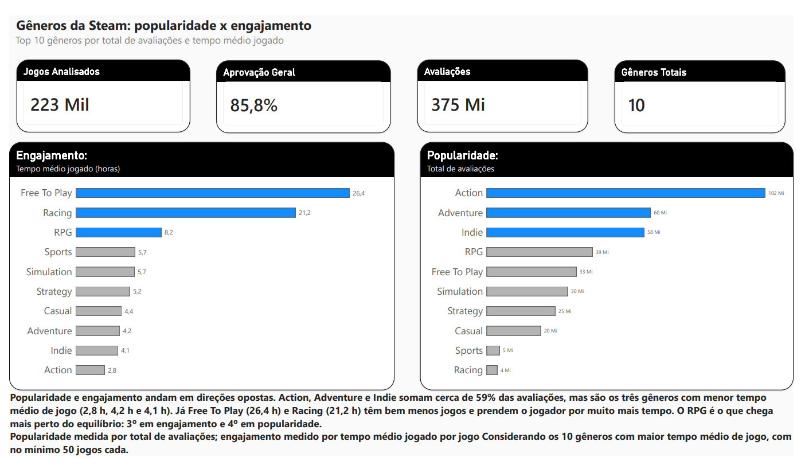

# 🎮 Steam Data Analysis: Engajamento e Distribuição de Gêneros

Projeto de análise exploratória de dados (EDA) sobre o catálogo da Steam, combinando validação e filtragem em SQL com pipeline de tratamento e agregação em Python (Pandas).

---

## 📌 Visão Geral do Projeto

O objetivo desta análise é identificar os **Top 10 gêneros de jogos com maior engajamento** (tempo médio de jogo por usuário) e avaliar a respectiva taxa de aprovação da comunidade.

A pipeline trata dados nulos, desmembra gêneros híbridos e remove categorias utilitárias e softwares que não se enquadram como jogos eletrônicos.

---

## 📊 Dashboard no Power BI



O dashboard compara **popularidade** (total de avaliações) e **engajamento** (tempo médio jogado por jogo) nos gêneros da Steam.

**Principais conclusões**
* Adventure e Indie concentram 43% das avaliações, mas têm os menores tempos médios (4,2 h e 4,1 h).
* Free To Play (26,4 h) e Racing (21,2 h) têm menos jogos, mas prendem o jogador por muito mais tempo.
* O RPG é o único gênero no top 3 de popularidade e de engajamento.

📁 [Baixar o arquivo .pbix](powerbi/popularidade_engajamento_steam.pbix)

---

## 🛠️ Tecnologias Utilizadas

* **SQL (MySQL):** Validação de qualidade de dados, categorização (Gratuito vs. Pago) e agregação preliminar.
* **Python 3:** Pipeline automatizada de limpeza, desmembramento e agregação de dados.
* **Pandas:** Manipulação de DataFrames, tratamento de nulos, `.explode()` de listas e `.groupby()`.
* **Jupyter Notebook / VS Code:** Ambiente de desenvolvimento e documentação.
* **Power BI:** Dashboard com medidas DAX (`RANKX`, `DIVIDE`) e formatação condicional para destacar o top 3.

---

## 📂 Etapas da Pipeline de Dados

1. **Validação Inicial via SQL:**
   * Filtragem de registros nulos (`AppID` e `Genres`).
   * Exclusão de jogos sem interatividade (`Positive + Negative = 0`).
   * Categorização de jogos em *Gratuitos* e *Pagos*.

2. **Tratamento e Engenharia de Dados em Python:**
   * **Desmembramento de Gêneros Híbridos:** Aplicação de `.str.split(',')` seguido de `.explode()` para contabilizar gêneros compostos individualmente.
   * **Remoção de Utilitários:** Filtragem de categorias como `Audio Production`, `Utilities`, `Web Publishing`, entre outras.
   * **Relevância Estatística:** Filtro para considerar apenas gêneros com no mínimo 50 jogos cadastrados no catálogo.
   * **Métricas Calculadas:** Conversão do tempo médio de jogo para horas e cálculo da taxa de aprovação percentual `(Positivas / Totais) * 100`.

3. **Visualização no Power BI:**
   * Importação do CSV agregado (`top_10_generos_steam.csv`) e tratamento de tipos no Power Query.
   * Criação de medidas para aprovação geral, tempo médio em horas e ranking.

---

## 🚀 Como Executar o Projeto

1. Clone o repositório:
```bash
   git clone https://github.com/TreferDG/steam-analysis-monetization.git
```

2. Instale a biblioteca necessária:
```bash
   pip install pandas
```

3. Execute o script Python:
```bash
   python Projeto.py
```

## ✉️ Contato
Desenvolvido por Danilo

* **LinkedIn:** [Danilo Guerreiro](https://www.linkedin.com/in/danilo-guerreiro-66a35737a)
* **GitHub:** [Danilo Guerreiro](https://github.com/TreferDG)
